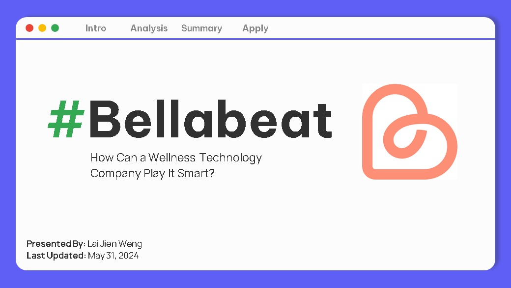

# Lai Jien Weng

Hi there! I'm a **Data Science Enthusiast** studying in Applied Mathematics with Computing student at Universiti Tunku Abdul Rahman, skilled in **predictive modeling**, **machine learning**, and **data analysis** using **R** and **Python**. Demonstrated leadership in academic projects and possess strong analytical capabilities. Committed to continuous learning and growth in the field.

Skills: 
Python / R / Scikit-Learn / Data Visualisation / SQL

- 👯 I’m looking to collaborate on Data Science / Machine Learning Projects 
- 📫 How to reach me: reallyhat@gmail.com 

## Checkout my project below!
|   |  |
|--|--|
|  |  |
